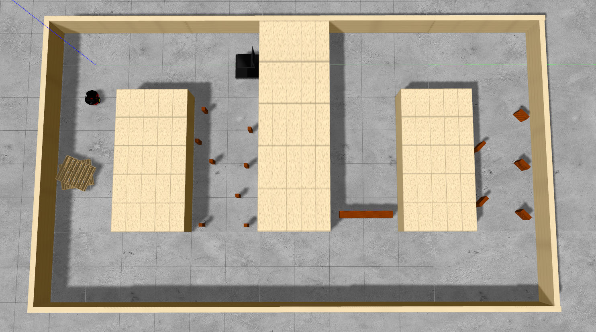

  
# UML HRI Nerve Nav Sim Resources 

## About:
The UML HRI Nerve Nav Sim Resources package provides all of the simulation resources for the UML HRI Nerve Navigation package.  This package is designed to be used in conjuction with the UML HRI Nerve Navigation package.  The Gazebo simulator is used for all of the simulations. Refer to the UML HRI Nerve Navigation package for documentation on how to run navigation tests.

## UML HRI Nerve Navigation Package Suite Setup:
1. Clone this repository and the Nav Sim Resources repository and into your catkin workspace.
  > cd ~/<your_ws>/src   
  > git clone https://github.com/uml-robotics/uml_hri_nerve_navigation.git
  > git clone https://github.com/uml-robotics/uml_hri_nerve_nav_sim_resources.git
2. Attempt to build your catkin workspace (will fail building helps with later steps).   
  > cd ..  
  > catkin build   
3. Source the workspace.  
  > source devel/setup.bash
4. Install package dependencies
  > rosdep update   
  > rosdep install uml_hri_nerve_navigation  
  > rosdep install uml_hri_nerve_nav_sim_resources   
  If this fails, all of the packages needed are in the package.xml file and use sudo apt install ros-[ROS_VERSION]-[PKG_NAME] to install the necessary packages
5. Build your catkin workspace.   
  > cd ..  
  > catkin build   
6. Source the workspace.  
  > source devel/setup.bash
7. Also, a setup bash script must be ran in the UML HRI Nerve Nav Sim Resources package before running any simulations
  > roscd uml_hri_nerve_nav_sim_resources    
  > . setup.sh

At this point, if all goes well, all of the uml navigation packages should be ready to run.  

**NOTE BEFORE STARTING:** Sometimes Gazebo can be a bit finicky, and may fail to launch properly for an array of reasons. If something goes wrong, Ctrl+c on the launch file that launched Gazebo and try again a few times. If the problem persists there may be an actual issue that needs to be resolved first, but unless you've already started making changes within this package, that shouldn't be the case.  

## Important Launch Files:    
* **setup_simulation.launch** - This is a high level launch file that includes all of the necessary launch files required to start a simulation with a robot. There are several arguments for this launch file that allow for a modular setup of a simulated world.  Note this launch file is usually launched through the use of a level launch file   
**Arguments:**
  * **gui (default: true)** - Boolean argument that specifies whether the Gazebo GUI will open or not
  * **robot (default: pioneer)** - String argument that specifies which robot to spawn in.
  * **spawn_x (default: 0)** - Double argument that specifies the x coordinate that the robot will spawn in at
  * **spawn_y (default: 0)** - Double argument that specifies the y coordinate that the robot will spawn in at
  * **spawn_z (default: 0)** - Double argument that specifies the z coordinate that the robot will spawn in at
  * **spawn_yaw (default: 0)** - Double argument that specifies the yaw that the robot will spawn in with (in radians)
  * **world_path (default: level1.world)** - String argument that specifies the file location of the .world file to set up in Gazebo relative to the uml_hri_nerve_nav_sim_resources/worlds folder.
  * **obstacle_bot (default: false)** - Boolean argument that specifes whether to spawn in an obstacle_bot or not
  * **spawn_obstacle_bot_x (default: 1)** - Double argument that specifies the x coordinate that the obstacle_bot will spawn in at
  * **spawn_obstacle_bot_y (default: 0)** - Double argument that specifies the y coordinate that the obstacle_bot will spawn in at
  * **spawn_obstacle_bot_z (default: 0)** - Double argument that specifies the z coordinate that the obstacle_bot will spawn in at
  * **spawn_obstacle_bot_yaw (default: 0)** - Double argument that specifies the yaw that the obstacle_bot will spawn in with (in radians)
  * **dynamic_obstacle (default: false)** - Boolean argument that specifies whether to spawn in a dynamic obstacle or not
  * **obstacle_1_x (default: 0)** - Double argument that specifies one of the x coordinates that the dynamic obstacle will spawn in at
  * **obstacle_1_y (default: 0)** - Double argument that specifies one of the y coordinates that the dynamic obstacle will spawn in at
  * **obstacle_1_z (default: 0)** - Double argument that specifies one of the z coordinates that the dynamic obstacle will spawn in at
  * **obstacle_1_theta (default: 0)** - Double argument that specifies one of the yaws that the dynamic obstacle will spawn in with (in radians)
  * **obstacle_2_x (default: 0)** - Double argument that specifies the other x coordinate that the dynamic obstacle will spawn in at
  * **obstacle_2_y (default: 0)** - Double argument that specifies the other y coordinate that the dynamic obstacle will spawn in at
  * **obstacle_2_z (default: 0)** - Double argument that specifies the other z coordinate that the dynamic obstacle will spawn in at
  * **obstacle_2_theta (default: 0)** - Double argument that specifies the other yaw that the dynamic obstacle will spawn in with (in radians)
  * **obstacle_name (default: caution_100cm_block)** - String argument that specifes the name of the obstacle folder in the models/obstacles folder to spawn in +as the dynamic obstacle
  * **flip_obstacle (default: false)** - Boolean argument that specifies whether the dynamic obstacle should spawn in at pose 1 or pose 2

  To launch a simulation (example):

  >roslaunch uml_hri_nerve_nav_sim_resources setup_simulation.launch world_path:=level4.world robot:=fetch gui:=true

* **[INSERT DESIRED WORLD].launch** - This launch does the same thing as the setup_simulation.launch file but the arguments that are specific to the Gazebo world are set.
**Arguments:**
  * Same as the setup_simulation.launch file, but the gui, robot, obstacle_bot, dynamic_obstacle, obstacle_name, and flip_obstacle argument should be the only arguments specified by the user when launching

  To launch a specified world simulation (example):

  >roslaunch uml_hri_nerve_nav_sim_resources level4.launch robot:=fetch gui:=true

* **spawn_world.launch** - Launches Gazebo as an empty world or loads a specific world file. This launch file does not include any robots. This file is included in other launch files to reduce their complexity, and it can be useful for creating or modifying world files.  
**Arguments:**
  * **load_world (default: true)** - Boolean argument that specifies whether the launch an empty world or a specific world from a .world file
  * **world_path (default: level1.world)** - String argument that specifies the file location of the .world file to set up in Gazebo relative to the uml_hri_nerve_nav_sim_resources/worlds folder.
  * **gui (default: true)** - Boolean argument that specifies whether the Gazebo GUI will open or not

  To launch an empty world:  
  > roslaunch uml_hri_nerve_nav_sim_resources spawn_world.launch load_world:=false  

  To specify a world:  
    > roslaunch uml_hri_nerve_nav_sim_resources spawn_world.launch world_path:=[world path starting after the worlds folder inluding the .world extension]  

* **spawn_[INSERT DESIRED ROBOT].launch** - Spawns in the desired robot into Gazebo. Note that Gazebo must be running before launching this file. Also this launch file is usually ran from a higher level launch file.
**Arguments:**
  * **x (default: 0.0)** - Double argument that specifies the x coordinate that the robot spawns in at
  * **y (default: 0.0)** - Double argument that specifies the y coordinate that the robot spawns in at
  * **z (default: 0.0)** - Double argument that specifies the z coordinate that the robot spawns in at
  * **yaw (default: 0.0)** - Double argument that specifies the yaw that that robot spawns in with (in radians)

  To spawn a fetch robot with a specified position (example):  
  > roslaunch uml_hri_nerve_nav_sim_resources spawn_fetch.launch x:=5.0 y:=5.0 yaw:=3.14

## Adding a New World:
  TODO

## Adding a New Robot:
  TODO

## File Structure:  
* **launch/** - Contains all necessary ROS .launch files.  
  * **levels/** - Contains all of the .launch files for setting up the various simulated worlds.
  * **robots/** - Contains all of the .launch files for spawning in various robots into Gazebo.
* **msg/** - Custom ROS message definition.  
* **resources/** - Package resources.  
  * **config/** - Contains the configurations for all of the robots.  Each robot has its own subfolder. The configurations are for Gazebo specific configs  
  * **models/** - Contains package models.  Individual robot models and definitions are found in this folder as well
    * **[ROBOT]/defs** - Contains the URDF and Xacro files for the robot
    * **[ROBOT]/models** - Contains 3D models for visualizing the robot in Gazebo
    * **obstacles/** - Contains obstacle models for making new worlds.   
    * **track_models/** - Contains track models for making new worlds.
  * **screenshots/** - Contains screenshots from various tests performed as well as visuals for documentation
  * **textures/** - Contains custom Gazebo texture files.  
* **src/** - Contains all c++ source files.  
  * **dynamic_obstacle_spawner.cpp** - Spawns an obstacle at specified location and teleports the obstacle between the original and a second specified location between robot navigation iterations. This node requires the nav stack on a robot to be running to trigger the dynamic_obstacle_spawner to switch the obstacle's location.
  * **reset_robot.cpp** - Subscribes to the /spawn topic and resets the robot models position.  
  * **spawn_pub.cpp** - Publishes the robots spawn location on the /spawn topic.   
* **worlds/** - Contains all .world files for Gazebo to load.  
* **setup.sh** - A setup script that makes the models and textures provided in this package available for Gazebo to use.  
## Useful Resources:  
[ROS Tutorials](http://wiki.ros.org/ROS/Tutorials)  
[Gazebo Tutorials](http://gazebosim.org/tutorials)  
[ROS .launch file documentation](http://wiki.ros.org/roslaunch/XML)  

[URDF Tutorials](http://wiki.ros.org/urdf/Tutorials)   
[URDF XML Specification](https://wiki.ros.org/urdf/XML)   
[SDF (Simulation Description Format) Specification for Gazebo Models](http://sdformat.org/spec)  
[OGRE Material Script Documentation (Gazebo Textures)](https://ogrecave.github.io/ogre/api/1.12/_material-_scripts.html)
